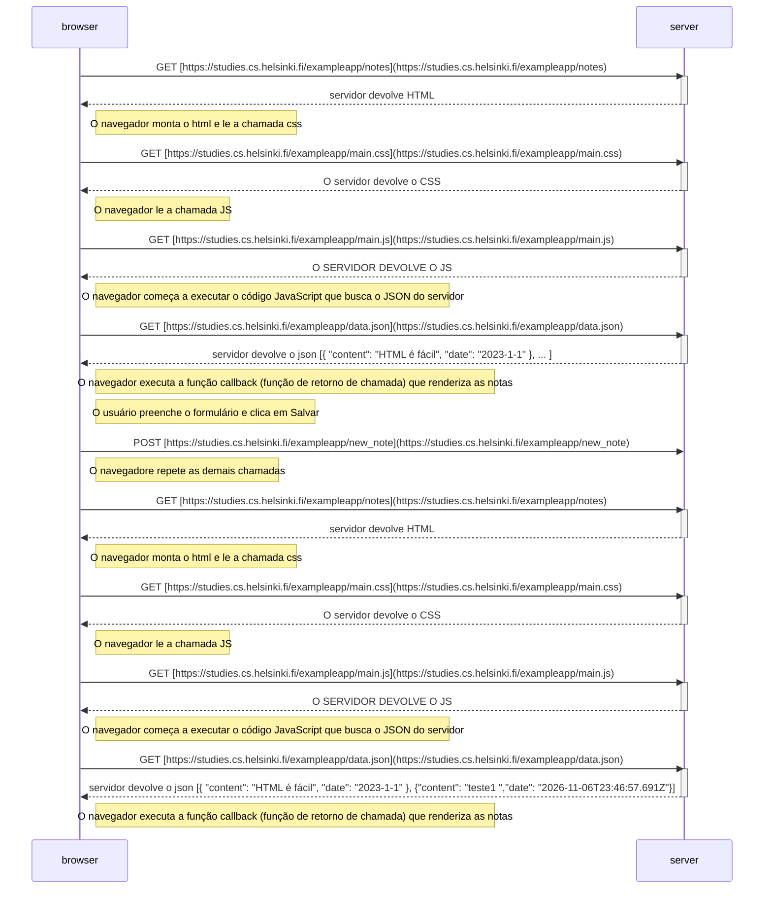

```mermaid
sequenceDiagram
    participant browser
    participant server

    browser->>server: GET [https://studies.cs.helsinki.fi/exampleapp/notes](https://studies.cs.helsinki.fi/exampleapp/notes)
    activate server
    server-->>browser: servidor devolve HTML
    deactivate server

    Note right of browser: O navegador monta o html e le a chamada css

    browser->>server: GET [https://studies.cs.helsinki.fi/exampleapp/main.css](https://studies.cs.helsinki.fi/exampleapp/main.css)
    activate server

    server-->>browser:  O servidor  devolve o CSS
    deactivate server


    Note right of browser: O navegador le a chamada JS
    browser->>server: GET [https://studies.cs.helsinki.fi/exampleapp/main.js](https://studies.cs.helsinki.fi/exampleapp/main.js)
    activate server
    server-->>browser: O SERVIDOR DEVOLVE O JS
    deactivate server

    Note right of browser: O navegador começa a executar o código JavaScript que busca o JSON do servidor

    browser->>server: GET [https://studies.cs.helsinki.fi/exampleapp/data.json](https://studies.cs.helsinki.fi/exampleapp/data.json)
    activate server
    server-->>browser: servidor devolve o json [{ "content": "HTML é fácil", "date": "2023-1-1" }, ... ]
    deactivate server

    Note right of browser: O navegador executa a função callback (função de retorno de chamada) que renderiza as notas


    Note right of browser: O usuário preenche o formulário e clica em Salvar

    browser->>server: POST [https://studies.cs.helsinki.fi/exampleapp/new_note](https://studies.cs.helsinki.fi/exampleapp/new_note)

    Note right of browser: O navegadore repete as demais chamadas

    browser->>server: GET [https://studies.cs.helsinki.fi/exampleapp/notes](https://studies.cs.helsinki.fi/exampleapp/notes)
    activate server
    server-->>browser: servidor devolve HTML
    deactivate server

    Note right of browser: O navegador monta o html e le a chamada css

    browser->>server: GET [https://studies.cs.helsinki.fi/exampleapp/main.css](https://studies.cs.helsinki.fi/exampleapp/main.css)
    activate server

    server-->>browser:  O servidor  devolve o CSS
    deactivate server


    Note right of browser: O navegador le a chamada JS
    browser->>server: GET [https://studies.cs.helsinki.fi/exampleapp/main.js](https://studies.cs.helsinki.fi/exampleapp/main.js)
    activate server
    server-->>browser: O SERVIDOR DEVOLVE O JS
    deactivate server

    Note right of browser: O navegador começa a executar o código JavaScript que busca o JSON do servidor

    browser->>server: GET [https://studies.cs.helsinki.fi/exampleapp/data.json](https://studies.cs.helsinki.fi/exampleapp/data.json)
    activate server
    server-->>browser: servidor devolve o json [{ "content": "HTML é fácil", "date": "2023-1-1" }, {"content": "teste1 ","date": "2026-11-06T23:46:57.691Z"}]
    deactivate server

    Note right of browser: O navegador executa a função callback (função de retorno de chamada) que renderiza as notas


```
